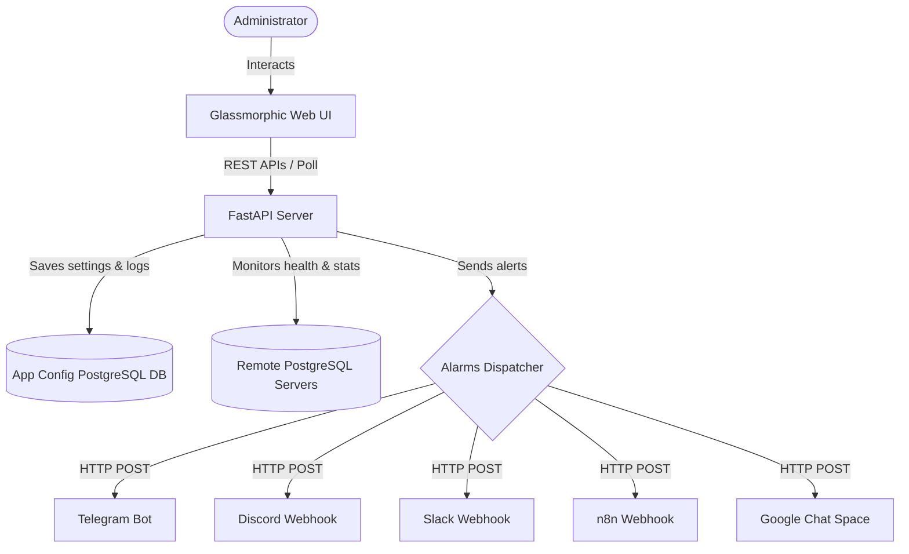

# PostgreSQL Performance Monitor & Alerting Application (PG-Mon)

A lightweight, self-hosted web dashboard designed to monitor performance, active queries, cache hit ratios, and table index statistics across remote PostgreSQL database servers. Features custom real-time alert dispatching (via Telegram, Discord, Slack, n8n, and Google Chat) with anti-spam alert throttling, connection testing, and the ability to terminate runaway database processes directly from the UI.

---

## Key Features

- **Multi-Database Support**: Monitor multiple remote databases from a single consolidated control center.
- **Performance Metrology**: Read PostgreSQL cache-hit ratios, index usage, active pool ratios, database size, and temporary storage bytes/files pressure.
- **Active Query & Inactive Session Inspector**:
  - List currently executing queries, identifying their PID, client IP, username, and duration.
  - List inactive/locked sessions (e.g. `idle in transaction`) to track holding locks.
- **Runaway Process Termination (Kill Query)**: Stop slow or locking database processes with a single click in the UI.
- **Lock & Blocking Monitors**: Detect query locks where one connection blocks another, and send critical alarms.
- **Advanced Telemetry sub-tabs**:
  - **🧹 Autovacuum Health**: View active autovacuum workers and identify tables with the highest dead tuples.
  - **🔄 Replication Lag**: Track standby replica lag size (MB) for primary servers or recovery delay time for replicas.
  - **⚠️ Transaction ID Wraparound**: Monitor database and table transaction ages to stay ahead of the 2-billion transaction limit.
- **Dynamic Alerts Configurator**: Easy toggling and configuration of Slack, Discord, Telegram, n8n, and Google Chat webhook credentials.
- **🧪 Test Alerting Channels**: Test your webhook bot configurations instantly with mock alerts before saving.
- **Smart Alert Throttling**: Implements in-memory alert deduplication (10 minutes silence window) to prevent spamming your alert channels for long-running issues.
- **Premium Glassmorphic Dark UI**: High contrast typography, neon accents, and smooth transitions.

---

## Architecture Diagram



---

## 🚀 Installation & Deployment

### Method 1: Using Docker & Docker Compose (Recommended)

This is the easiest way to deploy the application on your server. Docker Compose launches both the web application and its dedicated PostgreSQL database container to store configs and logs.

1. **Clone the repository**:
   ```bash
   git clone https://github.com/edjiesa/postgresql10.4Mon.git
   cd postgresql10.4Mon
   ```

2. **Launch with Docker Compose**:
   ```bash
   docker-compose up -d --build
   ```

3. **Verify the containers are running**:
   ```bash
   docker ps
   ```

4. **Access the application**:
   Open your browser and navigate to: **`http://<your-server-ip>:8000`**

*Note: The application configuration database is persistent under the Docker named volume pg-mon-db-data to preserve your database connections and settings.*

---

### Method 2: Manual Installation (Local Development)

Ensure you have **Python 3.11+** installed on your system, and an active PostgreSQL server to store PG-Mon configuration tables.

1. **Create and activate a virtual environment**:
   - **Windows**:
     ```powershell
     python -m venv venv
     .\venv\Scripts\activate
     ```
   - **Linux/macOS**:
     ```bash
     python3 -m venv venv
     source venv/bin/activate
     ```

2. **Install packages**:
   ```bash
   pip install -r requirements.txt
   ```

3. **Configure environment variables & run FastAPI server**:
   - **Windows (PowerShell)**:
     ```powershell
     $env:APP_DB_HOST="localhost"
     $env:APP_DB_PORT="5432"
     $env:APP_DB_NAME="pg_mon"
     $env:APP_DB_USER="pg_mon"
     $env:APP_DB_PASS="pg_mon_pass"
     python -m backend.main
     ```
   - **Linux / macOS**:
     ```bash
     export APP_DB_HOST="localhost"
     export APP_DB_PORT="5432"
     export APP_DB_NAME="pg_mon"
     export APP_DB_USER="pg_mon"
     export APP_DB_PASS="pg_mon_pass"
     python -m backend.main
     ```

4. **Access the UI**:
   Open your web browser at **`http://localhost:8000`**

---

## ⚙️ Target PostgreSQL Configurations

To get the most out of **PG-Mon**, ensure the credentials you register have appropriate permissions on the target database servers:

1. **Monitoring Permissions**:
   To read active database connections, autovacuum stats, and system replication metrics, the database user should belong to the **`pg_monitor`** default role:
   ```sql
   GRANT pg_monitor TO your_monitoring_user;
   ```

2. **Kill Query Permissions**:
   To allow PG-Mon to terminate runaway or blocking queries (using `pg_terminate_backend`), the database user must:
   - Be a **Superuser**, OR
   - Be the **Owner** of the target query processes you want to terminate, OR
   - (For PostgreSQL 14+) Belong to the **`pg_signal_backend`** role:
     ```sql
     GRANT pg_signal_backend TO your_monitoring_user;
     ```

3. **Network access**:
   Ensure the remote PostgreSQL server permits TCP connections from your PG-Mon server IP in its `postgresql.conf` and `pg_hba.conf`:
   ```text
   # pg_hba.conf
   host    all             all             <pg-mon-ip>/32          scram-sha-256
   ```

---

## 🔔 Setting Up Alert Channels

All alert channels feature a **🧪 Test** button so you can send a mock performace alert to verify credentials immediately.

### 💬 Telegram Bot Configuration
1. Chat with `@BotFather` on Telegram to create a new bot and copy the **Bot Token**.
2. Create a Telegram channel or group, add your bot as an administrator, and get the **Chat ID** (e.g. using `@RawDataBot`).
3. Add these credentials in the **Alerts Config** tab and click **🧪 Test** to verify before saving.

### 🎮 Discord Webhook Configuration
1. Go to your Discord server, open **Server Settings** > **Integrations** > **Webhooks**.
2. Click **New Webhook**, select a channel, and copy the **Webhook URL**.
3. Paste the URL into the Discord card, test it, and save.

### 💼 Slack Webhook Configuration
1. Create a Slack App in your workspace, enable **Incoming Webhooks**, and click **Add New Webhook to Workspace**.
2. Copy the generated **Webhook URL** and paste it into the Slack card.

### 🔗 n8n Webhook Configuration
1. Create a workflow in your n8n workspace with a **Webhook Trigger** node (using the HTTP POST method).
2. Copy the Webhook URL and paste it into the n8n card.

### 💬 Google Chat Spaces Webhook Configuration
1. Open Google Chat, go to the Space where you want to receive alerts.
2. Click the Space header dropdown and select **Apps & integrations** > **Webhooks**.
3. Add a name, click **Save**, copy the webhook URL, and paste it into the Google Chat Space card.
